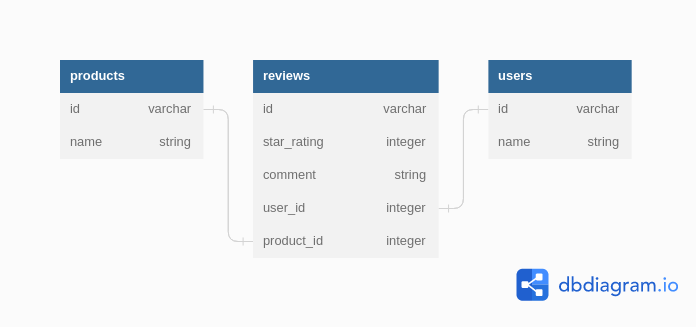

# phase-3-code-challenge-product-review
This repository will be focusing on the product reviews.
We have three models: User, Review, and Product.

A Product has many Users, a User has many Products’ s, and a Review belongs to a User and to a Product.

Product - User is a many-to-many relationship.

## Entity Relationship Diagram(ERD)

This project has three tables with the reviews tabla acting as the join table for the products and users table.

- products table: Has a many-to-many relationship with the users table
- reviews table: Has a one-to-many relationship with the users table and the products table with products through reviews having many users and vice versa
- users table: Has a many-to-many relationship with the products table

## Tools Used
This project was built with the following tools:

- [Ruby ~ v3.1.+](https://www.ruby-lang.org/en/)

## Topics Covered
The following are the concepts covered in this challenge session:
- Active Record Migrations
- Active Record Associations
- Class and Instance Methods
- Active Record QueryingProject Setup

Documentation on the Ruby language can be found here: [Ruby Docs](https://docs.ruby-lang.org/en/3.1/)

## Pre-requisites
In order to use this repo you need to have the following installed:

- OS [either: Windows 10+, Linux or MacOS(running on x86 or arm architecture)]
- Ruby - 3.1.+

## Installation

To use this repo on your machine requires some simple steps

### Alternative One

- Open a terminal / command line interface on your computer
- Clone the repo by using the following:

        git@github.com:Sammy-CK/phase-3-code-challenge-product-review.git

- Be patient as it creates a copy on your local machine for you.
- Change directory to the repo folder:

        cd phase-3-code-challenge-product-review

- (Optional) Open it in ``Visual Studio Code``

        code .

- (Alternate Option) Open it in any editor of your choice.

### Alternative Two

- On the top right corner of this page there is a button labelled ``Fork``.
- Click on that button to fork the repo to your own account.
- Take on the process in ``Alternative One`` above.
- Remember to replace your username when cloning.

        git clone https://github.com/your-username-here/phase-3-code-challenge-product-review

# Running the application

Running the application is very straight forward. You can use the following steps to run the app.

-   Install required dependancies
        
        bundle install

- Run the application on the terminal

      ruby bin/run.rb

# Authors
This project was contributed to by:
- [Sammy Cherono](https://github.com/Sammy-CK/)

# License
The project is licensed under Apache 2.0. 